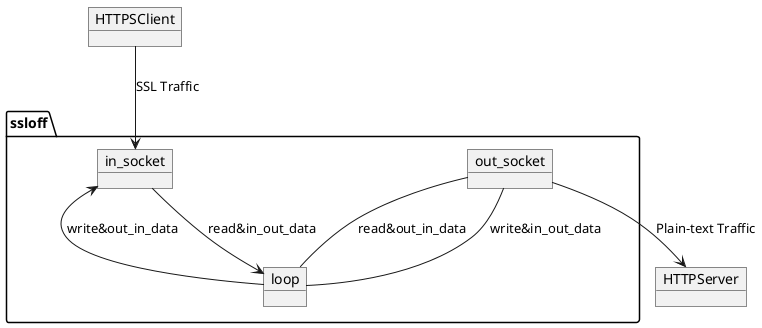

## The basic idea



## How to generate server self-signed cert and key

1. Generate private key

```bash
openssl genrsa -out server.key 2048
```

2. Signup self-signed ceritificate

```bash
openssl req -new -key server.key -out server.csr
openssl req -new -x509 -days 365 -key server.key -out server.crt
```

3. Pack cert and key into pem

```bash
cat server.crt server.key > server.pem
```

4. Generate Diffie–Hellman key exchange

```bash
openssl dhparam -out dhparam.pem 2048
```

## Test

Start server
```bash
python3 -m http.server 8080
```

Start SSL Proxy
```bash
./ssloff 8443 localhost 8080
```

Run client
```bash
curl -k -D - https://localhost:8443
```

